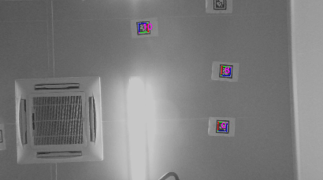
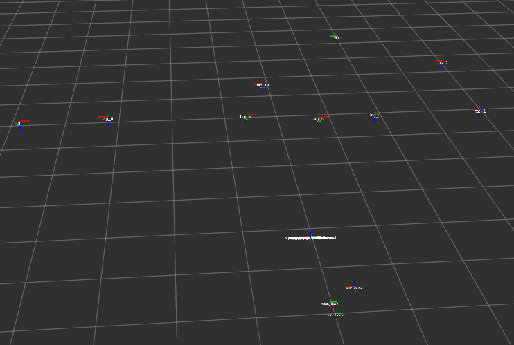

# IM(Intelligent Manufacture) Robot

这是一个基于tagslam算法的机器人定位导航项目。
 
--------------------------------

    作 者 : 南 山 二 毛

    版 本 : Ver1.0

    时 间 : 2020.05.20
 
---------------------------------
  
------------------------------------

## 1 如何启动

------------------------------------ 
```
roslaunch tagslam tagslam_navigation.launch
```


------------------------------------

## 2 程序包功能说明

------------------------------------
 
定位导航部分包含模块：

apriltag标签识别功能包：[apriltag](https://github.com/MRwangmaomao/tagslam_robot/tree/master/apriltag)

同步功能包：[flex_sync](https://github.com/MRwangmaomao/tagslam_robot/tree/master/flex_sync)

taglsam定位包：[tagslam](https://github.com/MRwangmaomao/tagslam_robot/tree/master/tagslam)

路径规划和轨迹控制：[path_plan_control](https://github.com/MRwangmaomao/tagslam_robot/tree/master/path_plan_control)

测试：[tagslam_test](https://github.com/MRwangmaomao/tagslam_robot/tree/master/tagslam_test)

小觅相机SDK:[MYNT-EYE-D-SDK](https://github.com/slightech/MYNT-EYE-D-SDK)
